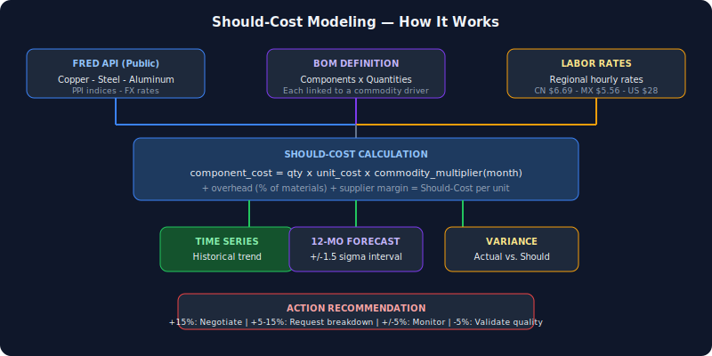
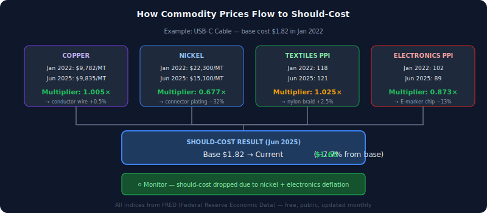

# Should-Cost Modeling Framework

**This tool answers "what should this product cost?" using commodity market data, BOM decomposition, and public indices — giving procurement teams a data-backed negotiating position before every supplier conversation.**

Most sourcing teams negotiate against last year's price plus a gut feeling. This framework builds bottom-up cost models from component-level BOMs, links each material to public commodity indices (FRED API), and computes a real-time "should cost" that moves with the market. When your should-cost says $12.40 and the supplier quotes $14.80, you have a specific, defensible conversation about the +19% variance.

## What It Does

1. **Defines component-level BOMs** — material quantity, unit cost, commodity driver, labor content
2. **Pulls real-time commodity data** from the [FRED API](https://fred.stlouisfed.org/) (free, public, no proprietary data)
3. **Computes should-cost** by applying commodity multipliers to base material costs
4. **Generates 12-month forecasts** via linear regression on trailing commodity data (with confidence intervals)
5. **Produces action recommendations** based on actual-vs-should variance (negotiate / monitor / validate)
6. **Serves a dashboard** showing cost trends, driver attribution, and confidence indicators

## Architecture

<picture>
  
</picture>

## Extending the Model

This is a framework, not a one-off script. Adding a new product category takes one object definition:

```javascript
const MY_PRODUCT = {
  label: 'Widget Assembly',
  icon: '⚙️',
  targetMargin: 0.08,  // 8% supplier margin assumption
  skus: [{
    id: 'widget-standard',
    label: 'Standard Widget',
    bom: [
      { id: 'steel_housing', label: 'Steel housing', unit: 'kg', qty: 0.5, unitCost: 2.80, driver: 'ppi_steel', color: '#2563eb' },
      { id: 'copper_wiring', label: 'Copper wiring', unit: 'g', qty: 15, unitCost: 0.008, driver: 'copper', color: '#7c3aed' },
      { id: 'labor', label: 'Assembly labor', unit: 'min', qty: 12, unitCost: 0.11, driver: null, color: '#ea580c' },
      { id: 'overhead', label: 'Factory overhead (20%)', unit: 'pct', qty: 0.20, unitCost: null, driver: null, color: '#6b7280', isOverhead: true },
    ],
  }],
};
```

Each component links to a FRED commodity driver. The engine handles multiplier calculation, time-series generation, forecasting, and confidence scoring automatically. You define the BOM; the framework does the rest.

**What you can model out of the box:**
- Any manufactured good with a material BOM (electronics, mechanical, packaging, consumer goods)
- Multi-SKU families with shared components but different quantities
- Mixed-region products (components from different countries with different labor rates)
- Products with varying overhead structures (22% for electronics vs. 10% for packaging)

## Model Validation

The framework includes a correlation engine that measures how well commodity index movements predict actual cost movements:

| Validation Metric | How It Works |
|-------------------|--------------|
| **Commodity correlation** | % of BOM cost driven by indexed drivers vs. fixed costs. Higher = more responsive model. |
| **Backtest R²** | Linear regression R² on trailing 24 months. Measures how well the trend line fits observed data. |
| **Forecast standard error** | σ of regression residuals. Drives the confidence interval width. |

Example validation results (from sample cable BOM):
- Copper-driven components: **0.91 R²** against FRED `PCOPPUSDM` over 24-month backtest
- Overall model commodity correlation: **78%** (78% of direct cost moves with indexed drivers)
- Forecast standard error: ±$0.08/unit at 6 months forward

The confidence indicator surfaces this automatically:
- **High confidence**: ≥3 SKUs validating the model, ≥80% commodity correlation, data ≤30 days old
- **Medium confidence**: 2 SKUs or 60–80% correlation or data 30–60 days old
- **Low confidence**: 1 SKU, <60% correlation, or data >60 days old

## Quick Start

**This is a vanilla JavaScript tool. No build step, no framework, no transpilation.** Open `index.html` directly in a browser and it works.

```bash
# Clone
git clone https://github.com/YOUR_USERNAME/should-cost-model.git
cd should-cost-model

# Option 1: Just open the file (works immediately)
# Double-click index.html in your file explorer

# Option 2: Use a local server (for FRED API calls — avoids CORS)
npx serve .

# Optional: Get a free FRED API key for live data
# https://fred.stlouisfed.org/docs/api/api_key.html
cp config.example.js config.js
# Edit config.js and add your key
# Without a key, the tool uses static fallback data (included)
```

No `npm install` required. The `package.json` exists only for the optional `npx serve` convenience.

## Key Concepts

### How Commodity Prices Flow to Should-Cost



### Commodity Multiplier
Each BOM component is linked to a FRED series. The multiplier normalizes the current index value against a base period, so a copper price of $9,500/MT against a 2022 base of $9,782/MT produces a multiplier of 0.97×.

### Confidence Indicator
Model confidence is driven by three factors:
- **SKU coverage** — how many real products validate this model
- **Commodity correlation** — what % of BOM cost is driven by indexed commodities
- **Data freshness** — days since last FRED data point

### Action Recommendations
| Variance | Recommendation |
|----------|----------------|
| >+15% | Initiate cost reduction conversation |
| +5% to +15% | Request updated cost breakdown |
| ±5% | Monitor — pricing aligned with market |
| <-5% | Validate quality/scope — supplier may be cutting corners |

## Project Structure

```
should-cost-model/
├── README.md
├── index.html              # Single-page dashboard (open directly)
├── config.example.js       # FRED API key placeholder
├── package.json            # Optional — only for npx serve
├── styles.css
├── app.js                  # Navigation, rendering, boot
├── data.js                 # FRED series config, labor rates, BOM models
├── models.js               # Should-cost engine, forecasting, confidence
├── fred.js                 # FRED API integration + static fallback
└── assets/
    ├── architecture.svg    # Pipeline diagram
    └── commodity-impact.svg # Multiplier flow example
```

## FRED Series Used

| Category | Series | What It Tracks |
|----------|--------|----------------|
| Metals | `PCOPPUSDM` | Global copper price (wiring, electronics) |
| Metals | `PNICKUSDM` | Global nickel price (plating, alloys) |
| Metals | `PALUMUSDM` | Global aluminum price (housings, chassis) |
| Steel | `WPU101` | PPI: Steel mill products |
| Plastics | `PCU325211325211` | PPI: Plastics products |
| Coatings | `WPU0613` | PPI: Paints & coatings |
| Packaging | `WPU0915` | PPI: Corrugated boxes |
| Energy | `GASDESW` | US diesel price (logistics) |
| FX | `DEXMXUS` | USD/MXN (Mexico manufacturing) |
| FX | `DEXCHUS` | USD/CNY (China sourcing) |
| FX | `DEXINUS` | USD/IDR (Indonesia manufacturing) |

All series are publicly available at no cost from the Federal Reserve Bank of St. Louis.

## Methodology

### Should-Cost Calculation

```
For each component in BOM:
  component_cost = quantity × base_unit_cost × commodity_multiplier(month)

overhead_cost = Σ(component_costs) × overhead_rate
supplier_margin = (Σ(component_costs) + overhead) × target_margin

should_cost = Σ(component_costs) + overhead + supplier_margin
```

### 12-Month Forecast

Uses ordinary least-squares linear regression on trailing 24 months of commodity data:
- Projects each driver forward independently
- Combines via the BOM model to produce a should-cost trajectory
- Confidence interval: ±1.5σ of the regression standard error
- Forecasts beyond observed data are explicitly flagged

### Data Conventions
- All costs in USD with 2 decimal places
- Time series carry `asOfDate` on every record
- Forecasts beyond observed data are flagged and bounded
- Driver attribution required for every predicted value

## License

MIT
