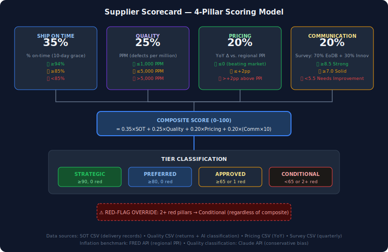
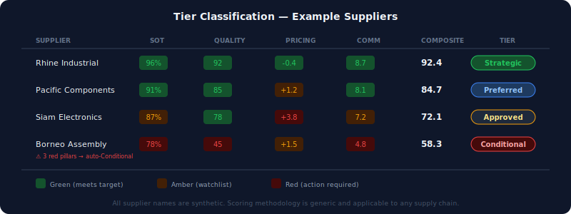

# Supplier Scorecard

**This tool gives sourcing teams a single, defensible number for every supplier — weighted across delivery, quality, cost, and communication — so that quarterly business reviews are backed by data, not anecdotes.**

Most supplier performance conversations start with "I feel like they've been better lately" or "their quality seems off." This scorecard replaces feelings with math: four pillar scores, a composite, a tier classification, and RAG indicators that surface problems before they become crises.

## What It Does

1. **Scores suppliers across 4 pillars**: Ship-on-Time (SOT), Quality (PPM), Pricing (vs. market inflation), Communication (stakeholder survey)
2. **Computes a weighted composite** (35% SOT + 25% Quality + 20% Pricing + 20% Communication)
3. **Classifies tiers**: Strategic / Preferred / Approved / Conditional — with red-flag overrides
4. **Generates external PDFs** for supplier business reviews (strips sensitive competitive data)
5. **Tracks trends** — month-over-month, quarter-over-quarter performance changes
6. **Surfaces exceptions** — suppliers crossing tier boundaries or hitting multiple red pillars

## Scoring Architecture



## Example: Tier Classification in Action



## Pillar Details

### Ship-on-Time (35% weight)
- **Formula**: `(totalPOs - latePOs) / totalPOs × 100`
- **Grace period**: 10 days — deliveries less than 10 days late count as on-time
- **RAG**: Green ≥94% | Amber ≥85% | Red <85%
- **Output**: Percentage + histogram of late-day distribution

### Quality (25% weight)
- **Formula**: `PPM = (manufacturer_defect_units / total_shipped) × 1,000,000`
- **Normalized**: `100 - min(100, PPM / 100)` (higher = better)
- **Classification**: AI-assisted categorization of return reasons (manufacturer_defect, damage_in_transit, customer_preference, etc.)
- **RAG**: Green ≤1000 PPM | Amber ≤5000 PPM | Red >5000 PPM

### Pricing (20% weight)
- **Formula**: `delta = supplier_weighted_YoY% - regional_PPI%`
- **Benchmark**: Uses FRED PPI data as the inflation baseline
- **RAG**: Green ≤0 (beating market) | Amber ≤+2pp | Red >+2pp
- **Guard**: Suppliers with <$50K spend or <3 SKUs get "insufficient data" flag

### Communication (20% weight)
- **Formula**: `0.70 × EoDB_avg + 0.30 × Innovation_avg` (survey scores 1–10)
- **Descriptors**: Strong ≥8.5 | Solid ≥7.0 | Developing ≥5.5 | Needs Improvement <5.5
- **RAG**: Green (Strong) | Amber (Solid/Developing) | Red (Needs Improvement)

## Tier Classification

| Tier | Criteria |
|------|----------|
| **Strategic** | Composite ≥90, zero red pillars |
| **Preferred** | Composite ≥80, zero red pillars |
| **Approved** | Composite ≥65, or exactly 1 red pillar |
| **Conditional** | Composite <65, or 2+ red pillars |

**Red-flag override**: Any supplier with 2+ red pillars is automatically Conditional regardless of composite score.

## Quick Start

```bash
git clone https://github.com/YOUR_USERNAME/supplier-scorecard.git
cd supplier-scorecard
npm install
npm run dev
```

Open `http://localhost:5173` in your browser.

## Project Structure

```
supplier-scorecard/
├── README.md
├── package.json
├── tsconfig.json
├── vite.config.ts
├── tailwind.config.ts
├── index.html
├── src/
│   ├── main.tsx
│   ├── App.tsx
│   ├── lib/
│   │   └── scoring/
│   │       ├── sot.ts              # Ship-on-Time scoring
│   │       ├── quality.ts          # Quality/PPM scoring
│   │       ├── pricing.ts          # Pricing vs PPI scoring
│   │       ├── communication.ts    # Survey scoring
│   │       ├── composite.ts        # Weighted composite
│   │       └── tier.ts             # Tier classification
│   ├── services/
│   │   ├── csvIngestion.ts         # CSV parsing + validation
│   │   └── fredService.ts          # FRED API for PPI benchmarks
│   ├── stores/
│   │   └── suppliersStore.ts       # Zustand state management
│   ├── pages/
│   │   ├── SupplierBrowserPage.tsx  # Filterable supplier table
│   │   └── Supplier360Page.tsx      # Single-supplier deep dive
│   ├── components/
│   │   ├── PillarTile.tsx
│   │   ├── TierBadge.tsx
│   │   ├── RAGBadge.tsx
│   │   ├── TrendChart.tsx
│   │   └── LateOrdersHistogram.tsx
│   └── data/
│       ├── schema.ts              # TypeScript interfaces
│       ├── config.ts              # Thresholds, weights
│       └── mockSuppliers.json     # Synthetic demo data
└── tests/
    └── lib/scoring/
        ├── sot.test.ts
        ├── quality.test.ts
        ├── pricing.test.ts
        ├── communication.test.ts
        └── tier.test.ts
```

## Tech Stack

- **React 19** + **TypeScript** — type-safe UI
- **Vite** — fast dev server and build
- **Tailwind CSS** — utility-first styling
- **Zustand** — lightweight state management
- **TanStack Table** — headless sortable/filterable tables
- **Recharts** — declarative charts
- **Vitest** + **fast-check** — unit + property-based testing
- **FRED API** — public inflation benchmarks (free API key)

## Correctness Properties (tested with fast-check)

1. `computeSOTScore` always returns percentOnTime in [0, 100]
2. `normalizePPM` is monotonically decreasing
3. `computeComposite` result is always in [0, 100]
4. Tier classification is monotonically non-decreasing with composite (holding RAG constant)
5. 2+ red pillars always produces "Conditional" regardless of composite value
6. `computeWeightedSurveyAverage` result is always in [1, 10] for inputs in [1, 10]

## Output Modes

The same UI renders two modes:
- **Internal**: Full composite scores, network comparisons, due-date change analytics
- **External**: Strips competitive data for sharing with suppliers during business reviews

External PDFs are generated via Puppeteer rendering the React app with `?output=external`.

## License

MIT
