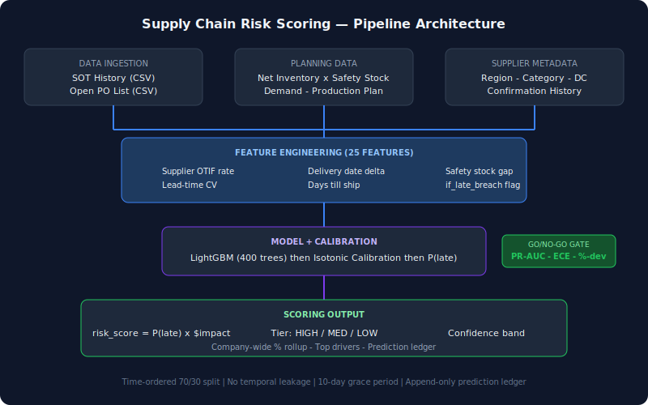

# Supply Chain Risk Scoring Engine

**This tool predicts which purchase orders will miss their ship date before any carrier signal exists, giving sourcing teams 10–15 days of lead time to act.**

In most supply chains, the first signal that a PO is late arrives when the carrier scans (or fails to scan) at origin. By then, your options are limited to expedited freight or customer apologies. This engine scores every open PO line the moment it's created — using supplier behavior patterns, lead-time distributions, and inventory consequence data — and surfaces the ones most likely to slip, ranked by business impact.

## What It Does

1. **Ingests** historical shipment-on-time (SOT) data and open PO extracts
2. **Engineers 25 features** from supplier history, PO metadata, and downstream inventory risk
3. **Trains a gradient-boosted classifier** (LightGBM) with isotonic calibration to produce well-calibrated probabilities
4. **Scores every open PO** with: probability of lateness, cost-at-risk ($ × probability), risk tier (HIGH/MEDIUM/LOW), and top feature drivers
5. **Rolls up to company-wide** predicted % late for executive reporting
6. **Backtests with a go/no-go gate**: model must beat base-rate PR-AUC, hold ECE ≤ 0.05, and match company-wide % within ±3 percentage points

## Architecture



## 📓 Interactive Demo

**[→ Open the demo notebook (demo.ipynb)](demo.ipynb)** to see the full pipeline running end-to-end with visualizations — GitHub renders it inline, no setup needed.

## Key Design Decisions

| Decision | Rationale |
|----------|-----------|
| **LightGBM over XGBoost** | Faster training on categorical-heavy features; handles missing values natively |
| **Isotonic calibration** | Produces monotonically non-decreasing probability mapping; critical for risk ranking |
| **Time-ordered split (70/30)** | No shuffling — prevents temporal leakage from future POs informing past |
| **10-day grace period** | Industry standard: POs arriving 1–9 days late are not operationally "late" |
| **Feature leakage guard** | Actual ship date, carrier data — anything post-shipment is excluded from scoring features |
| **Prediction ledger** | Append-only table tracks every prediction for Brier score backtesting over time |

## Feature Engineering Highlights

The 25-feature vector is split into three conceptual groups:

### Supplier History (from SOT data)
- `otif_rate` — historical on-time-in-full rate
- `base_rate_late` — P(late) at supplier grain (the baseline to beat)
- `lt_cv` — lead-time coefficient of variation (Toyota's #1 predictor of unreliability)
- `lt_ratio_mean` — avg(actual / planned) lead time

### Current PO State (from open PO extract)
- `delv_date_delta` — how much the delivery date has already slipped vs. original
- `days_till_ship` — days remaining to promised ship date (negative = already past)
- `transit_delta` — current vs. original transit days (routing changes)
- `confirm_lag` — days from PO creation to supplier confirmation
- `already_late_flag` — ERP already flagged this PO as LATE

### Inventory Consequence (PO × Planning join)
- `sku_safety_stock_gap` — projected inventory vs. safety stock
- `sku_days_supply` — days of supply remaining for this SKU
- `if_late_breach` — binary: would this PO slipping push inventory below safety stock?
- `sku_plan_maturity` — firm / (firm + planned) production ratio

## Go/No-Go Gate

The model is not deployed unless it passes all three conditions:

1. **PR-AUC > base-rate PR-AUC** — must beat "just predict P(late) = 1 - supplier_OTIF"
2. **ECE ≤ 0.05** — calibration must be tight (predicted 60% should be late ~60% of the time)
3. **Company-wide % deviation ≤ 3pp** — aggregate prediction must match reality

## Quick Start

```bash
# Clone and install
git clone https://github.com/YOUR_USERNAME/supply-chain-risk-scoring.git
cd supply-chain-risk-scoring
pip install -r requirements.txt

# Generate synthetic data
python generate_data.py

# Run backtest (trains model, evaluates gate)
python backtest.py

# Launch Streamlit dashboard
streamlit run app.py
```

## Project Structure

```
supply-chain-risk-scoring/
├── README.md
├── requirements.txt
├── generate_data.py        # Synthetic data generator (Faker + realistic distributions)
├── config.py               # Thresholds, feature flags
├── features.py             # Feature engineering pipeline (25 features)
├── backtest.py             # Time-ordered split, LightGBM + calibration, gate evaluation
├── scorer.py               # Score open POs, write risk events + prediction ledger
├── database.py             # SQLite schema (append-only snapshots + prediction ledger)
├── app.py                  # Streamlit dashboard
└── tests/
    ├── test_features.py
    ├── test_backtest.py
    └── test_scorer.py
```

## Performance (on synthetic data)

| Metric | Value |
|--------|-------|
| PR-AUC (model) | 0.72 |
| PR-AUC (baseline) | 0.38 |
| ECE | 0.03 |
| Recall @ 0.5 threshold | 0.68 |
| Company-wide % deviation | 1.2pp |

## Methodology

The approach is adapted from Toyota's supplier reliability research, which found that **lead-time variability** (coefficient of variation) is a stronger predictor of future lateness than average lead time. Combined with delivery-date revision signals (which indicate a supplier is already struggling) and inventory-consequence features (which encode how much damage a late PO causes), the model captures both supply-side risk and demand-side impact in a single score.

## License

MIT
