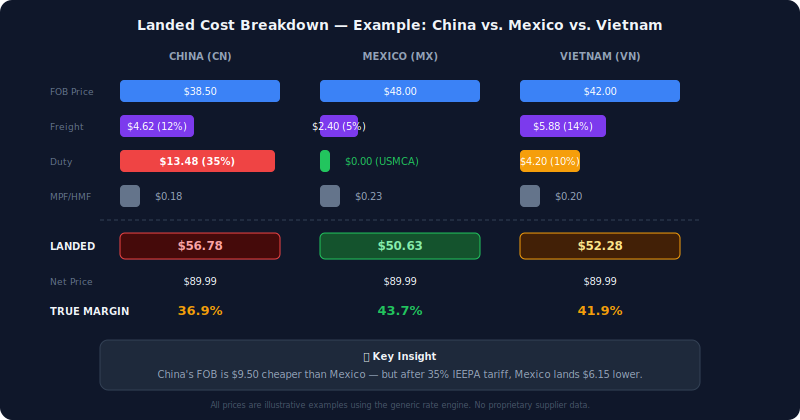

# Tariff & Landed Cost Calculator

**This tool computes the true cost of importing goods — not just the FOB price your supplier quotes, but the full landed cost including freight, duty, MPF/HMF, and inland transport — so sourcing teams can compare suppliers across countries on an equal basis.**

Built during the 2025–26 IEEPA tariff cycle, when a single executive order moved landed costs by 30%+ overnight for goods originating in China. When tariff policy changes faster than your spreadsheet updates, you need a tool that recomputes the entire portfolio in seconds.

A supplier in China quoting $50 and a supplier in Mexico quoting $58 are not $8 apart. After freight, tariffs (35% IEEPA reciprocal), and fees, the China supplier lands at $74 while Mexico lands at $61. This tool makes that math automatic.

## What It Does

1. **Loads SKU-level pricing data** (CSV/Excel upload — SAP material pricing export format)
2. **Looks up tariff rates** by HTS code and country of origin (static rate table + API shell for Descartes)
3. **Computes full landed cost**: FOB + ocean freight + duty + MPF/HMF + inland
4. **Calculates true margin** from landed cost (not just FOB markup)
5. **Models tariff scenarios** — "what if rates change by X%?" across your portfolio
6. **Identifies concentration risk** — how exposed are you to any single country?
7. **Detects rate changes** over time and calculates annualized impact

## How It Works



## Current Tariff Rate Table (US Import)

| Country | Base Avg | IEEPA Reciprocal | Effective Range |
|---------|----------|-----------------|-----------------|
| China (CN) | ~4% | 35% | 35–47% depending on product |
| Indonesia (ID) | ~3% | 32% | ~35% |
| Thailand (TH) | ~3% | 36% | ~38% |
| Vietnam (VN) | ~4% | 10% | ~14% |
| Malaysia (MY) | ~2% | 24% | ~26% |
| Japan (JP) | ~3% | 10% | ~13% |
| S. Korea (KR) | ~2% | 25% | ~27% |
| Mexico (MX) | 0% | 0% (USMCA) | 0% |
| Canada (CA) | 0% | 0% (USMCA) | 0% |

*Rates as of early 2026. Subject to change with trade policy.*

## Quick Start

**Vanilla JavaScript — no build step.** Open `index.html` directly in a browser.

```bash
git clone https://github.com/YOUR_USERNAME/tariff-landed-cost.git
cd tariff-landed-cost

# Option 1: Just open the file
# Double-click index.html

# Option 2: Local server
npx serve .
```

## Input Format

Upload a CSV or Excel file with these columns:

| Column | SAP Field | What It Is |
|--------|-----------|------------|
| Material | MATNR | 10-digit SKU identifier |
| Description | MAKTX | Material description |
| Supplier | LFA1 | Vendor name |
| StdNet | — | Standard net selling price (dealer price) |
| StdCost | — | Standard cost (finance's frozen cost) |
| PB00 | PB00 condition | Purchase price per unit (FOB — what you pay the supplier) |
| Currency | WAERS | Transaction currency |
| Per | PEINH | Price unit (e.g., 1 = per piece, 100 = per hundred) |
| COO | HERKL | Country of origin (2-letter ISO code) |
| HTS Code | STAWN | Harmonized Tariff Schedule code (8–10 digits) |

A sample CSV is included at `sample-data/example-skus.csv` with 10 synthetic SKUs across multiple countries.

## Landed Cost Formula

```
customs_value = PB00 (purchase price per unit, a.k.a. FOB)
freight       = PB00 × freight_rate_by_country_of_origin
duty          = customs_value × effective_tariff_rate(HTS_code, COO)
mpf_hmf       = customs_value × 0.004714  (Merchandise Processing Fee + Harbor Maintenance Fee)

landed_cost   = PB00 + freight + duty + mpf_hmf
true_margin   = (StdNet - landed_cost) / StdNet
```

## Project Structure

```
tariff-landed-cost/
├── README.md
├── index.html              # Single-page dashboard (open directly)
├── tariff-engine.js        # Core: rate lookup, landed cost, margin, scenarios
├── data.js                 # Tariff rates, freight rates, HTS category mapping
└── sample-data/
    └── example-skus.csv    # 10 synthetic SKUs for testing
```

## Freight Rate Assumptions (by COO)

| Origin | Rate (% of FOB) | Basis |
|--------|-----------------|-------|
| China | 12% | Ocean Shanghai/Shenzhen → US West Coast |
| Indonesia | 13% | Ocean Jakarta → US West Coast |
| Vietnam | 14% | Ocean HCMC → US West Coast |
| Thailand | 12% | Ocean Laem Chabang → US West Coast |
| Japan | 10% | Ocean Yokohama → US West Coast |
| S. Korea | 10% | Ocean Busan → US West Coast |
| Mexico | 5% | Truck/rail (USMCA corridor) |
| US Domestic | 3% | Inland freight only |

## Scenario Modeling

The tool supports "what-if" analysis:
- **Rate change**: "What if China tariffs increase by 10%?" → instant portfolio-wide margin impact
- **Country shift**: "What if we move these SKUs from CN to VN?" → compare landed costs side-by-side
- **Margin threshold**: "Which SKUs fall below 15% margin at the new rate?" → identifies the ones to act on first

## Key Features

- **Data quality filters** — automatically excludes placeholder SKUs (zero pricing, currency mismatches, net < FOB)
- **HTS-to-product category mapping** — matches 4-digit HTS prefix to product types for rate precision
- **Change detection** — compares current rates against previous to flag policy changes and annualized impact
- **Concentration analysis** — surfaces over-dependence on any single country of origin (top-2 share metric)
- **Descartes API shell** — placeholder for live duty rate lookup once API key is available; falls back to static rates gracefully

## Extending

To add a new country:

```javascript
COO_TARIFF_RATES['XX'] = {
  label: 'Country Name',
  rates: {
    'IEEPA_reciprocal': 0.15,  // 15% reciprocal tariff
    'base_avg': 0.03,           // 3% average HTS base rate
  },
  effectiveRanges: {
    'electronics': { rate: 0.18, note: '3% base + 15% reciprocal' },
  },
};

FREIGHT_RATES_BY_COO['XX'] = 0.11;  // 11% of FOB for freight
```

## License

MIT
